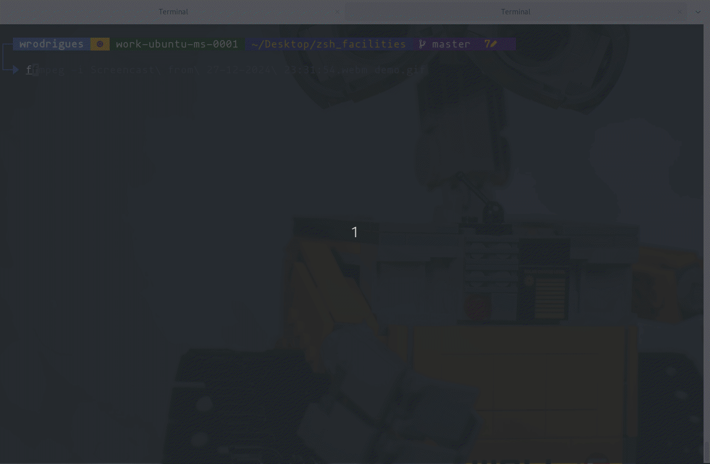

Welcome to ZSH Facilities
==========================

**Hi! This is "zsh_facilities"**, a set of scripts to
give you a better management of your zsh config and
init files.



Now it is easier to locate and change
your functions, aliases and configs.

Zsh is your friend, go ahead and make it your way!

Requisites
----------

If you have any problems, try installing the following dependencies:

`sudo apt-get install curl git`

Install
-------

To install, open your terminal and type:

```bash
curl 'https://raw.githubusercontent.com/wesleyit/zsh_facilities/master/install.sh' -o '/tmp/zsh_f_install.sh'
bash /tmp/zsh_f_install.sh
```

Some parts will take a lot of time, as we are compiling binaries in Rust.

When it finish, exit the terminal and open it again. It is done!
